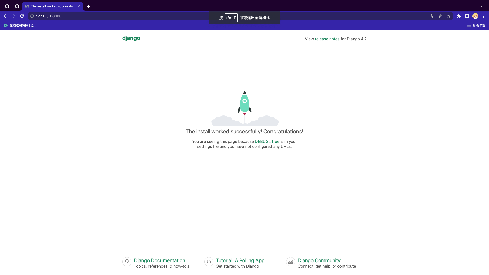
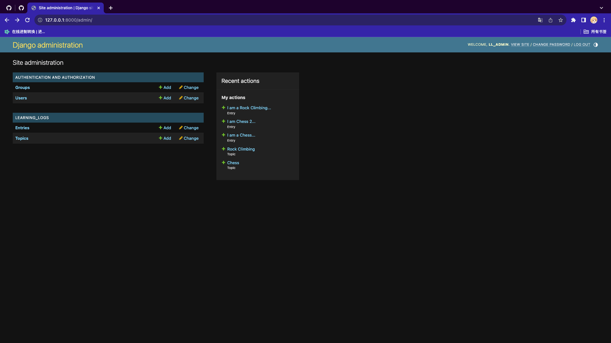
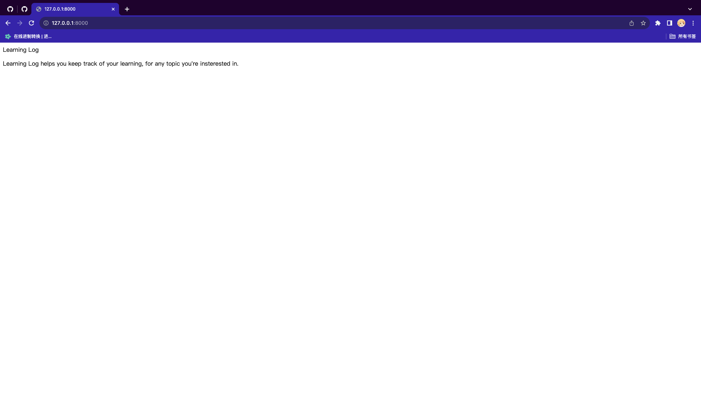
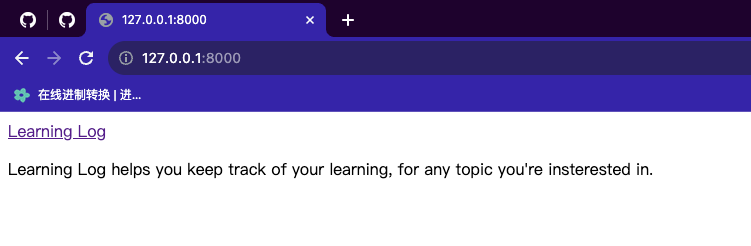
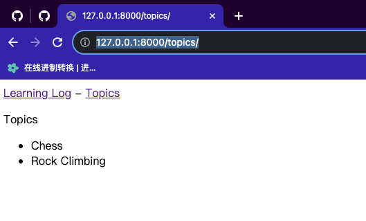
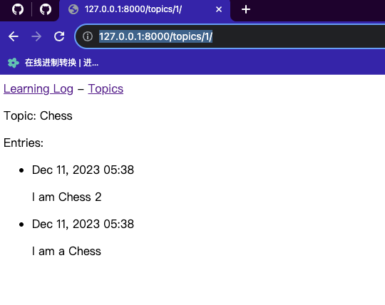

# WebApplication

## 1. Django入门

### 1.1 建立项目

#### 1.1.1 建立虚拟环境

虚拟环境：虚拟环境是系统的一个位置，你可以在其中安装包，并将这些包与其他Python包隔离起来。

先新建一个目录：`learning_log`

然后进入目录`learning_log`，并执行命令：

```bash
(venv)  niu0217@niuM  ~/niuGithub/WebApplication/Dev/learning_log   main ±  python -m venv ll_env     
(venv)  niu0217@niuM  ~/niuGithub/WebApplication/Dev/learning_log   main ±  ls
ll_env
```

此时创建了一个名为`ll_env`的虚拟环境。然后我们激活它：

```bash
(venv)  niu0217@niuM  ~/niuGithub/WebApplication/Dev/learning_log   main ±  source ll_env/bin/activate
(ll_env)  niu0217@niuM  ~/niuGithub/WebApplication/Dev/learning_log   main ±  
```

此时我们就进入到了虚拟环境中。

#### 1.1.2 安装Django

激活虚拟环境后，执行命令：

```bash
(ll_env)  niu0217@niuM  ~/niuGithub/WebApplication/Dev/learning_log   main ±  pip install --upgrade pip
(ll_env)  niu0217@niuM  ~/niuGithub/WebApplication/Dev/learning_log   main ±  pip install django
```

注意：Django仅在虚拟环境ll_env处于活动状态时才可以使用。

#### 1.1.3 在Django中创建项目

执行命令：

```bash
(ll_env)  niu0217@niuM  ~/niuGithub/WebApplication/Dev/learning_log   main ±  django-admin startproject ll_project .
(ll_env)  niu0217@niuM  ~/niuGithub/WebApplication/Dev/learning_log   main ±  ls
ll_env     ll_project manage.py
(ll_env)  niu0217@niuM  ~/niuGithub/WebApplication/Dev/learning_log   main ±  ls ll_project   
__init__.py asgi.py     settings.py urls.py     wsgi.py
(ll_env)  niu0217@niuM  ~/niuGithub/WebApplication/Dev/learning_log   main ±  
```

此时创建了一个名为`ll_project`的项目。其中自动创建了几个文件：

+ settings.py：指定Django如何与系统交互以及如何管理项目。
+ urls.py：告诉Django，应创建哪些网页来响应浏览器请求。
+ wsgi.py：帮组Django提供它创建的文件。

#### 1.1.4 创建数据库

执行命令：

```bash
(ll_env)  niu0217@niuM  ~/niuGithub/WebApplication/Dev/learning_log   main ±  python manage.py migrate
(ll_env)  niu0217@niuM  ~/niuGithub/WebApplication/Dev/learning_log   main ±  ls           
db.sqlite3 ll_env     ll_project manage.py

```

#### 1.1.5 查看项目

执行命令：

```bash
(ll_env)  niu0217@niuM  ~/niuGithub/WebApplication/Dev/learning_log   main ±  python manage.py runserver

```

 

### 1.2 创建应用程序

在前面打开的终端窗口运行着runserver，然后打开一个新终端窗口，执行命令：

```bash
(venv)  niu0217@niuM  ~/niuGithub/WebApplication/Dev   main ±  cd learning_log
(venv)  niu0217@niuM  ~/niuGithub/WebApplication/Dev/learning_log   main ±  source ll_env/bin/activate
(ll_env)  niu0217@niuM  ~/niuGithub/WebApplication/Dev/learning_log   main ±  python manage.py startapp learning_logs
(ll_env)  niu0217@niuM  ~/niuGithub/WebApplication/Dev/learning_log   main ±  ls
db.sqlite3    learning_logs ll_env        ll_project    manage.py
(ll_env)  niu0217@niuM  ~/niuGithub/WebApplication/Dev/learning_log   main ±  ls learning_logs
__init__.py admin.py    apps.py     migrations  models.py   tests.py    views.py
(ll_env)  niu0217@niuM  ~/niuGithub/WebApplication/Dev/learning_log   main ±  

```

命令`startapp appname`让Django创建应用程序所需的基础设施，其中重要的文件有：

+ models.py：定义要在应用程序中管理的数据
+ admin.py：
+ views.py：

#### 1.2.1 定义模型Topic

修改文件：`/Dev/learning_log/learning_logs/models.py`

模型就是一个类，告诉Django如何处理应用程序中存储的数据。

```python
from django.db import models


# Create your models here.
class Topic(models.Model):
    """用户学习的主题"""

    text = models.CharField(max_length=200)  # 用于存储标题、名称等小文本
    date_added = models.DateTimeField(auto_now_add=True)  # 获取当前时间

    def __str__(self):
        """返回模型的字符串表示"""
        return self.text
      
```

#### 1.2.2 激活模型

修改`/Dev/learning_log/ll_project/settings.py`，将其中的INSTALLED_APPS变量修改为如下形式：

```python
INSTALLED_APPS = [
    # 我的应用程序
    'learning_logs',

    # Django默认添加的应用程序
    'django.contrib.admin',
    'django.contrib.auth',
    'django.contrib.contenttypes',
    'django.contrib.sessions',
    'django.contrib.messages',
    'django.contrib.staticfiles',
]
```

#### 1.2.3 迁移模型Topic

让Django修改数据库，使其能够存储与模型Topic相关的信息。执行命令：

```bash
(ll_env)  niu0217@niuM  ~/niuGithub/WebApplication/Dev/learning_log   main ±  python manage.py makemigrations learning_logs
Migrations for 'learning_logs':
  learning_logs/migrations/0001_initial.py
    - Create model Topic
(ll_env)  niu0217@niuM  ~/niuGithub/WebApplication/Dev/learning_log   main ±  
```

输出明Django创建了一个名为0001_initial.py的迁移文件，这个文件将在数据库中为模型Topic创建一个表。

然后利用这种迁移，让Django替我们修改数据库：

```bash
(ll_env)  niu0217@niuM  ~/niuGithub/WebApplication/Dev/learning_log   main ±  python manage.py migrate   
Operations to perform:
  Apply all migrations: admin, auth, contenttypes, learning_logs, sessions
Running migrations:
  Applying learning_logs.0001_initial... OK
(ll_env)  niu0217@niuM  ~/niuGithub/WebApplication/Dev/learning_log   main ±  

```

#### 1.2.4 用Django管理网站

（1）创建超级用户

```bash
(ll_env)  niu0217@niuM  ~/niuGithub/WebApplication/Dev/learning_log   main ±  python manage.py createsuperuser
Username (leave blank to use 'niu0217'): ll_admin
Email address: 
Password: 
Password (again): 
This password is too short. It must contain at least 8 characters.
This password is too common.
This password is entirely numeric.
Bypass password validation and create user anyway? [y/N]: y
Superuser created successfully.
(ll_env)  niu0217@niuM  ~/niuGithub/WebApplication/Dev/learning_log   main ±  

```

（2）向网站注册模型

修改`/Dev/learning_log/learning_logs/admin.py`为如下代码：

```python
from django.contrib import admin

from .models import Topic

# 让Django通过管理网站管理模型
admin.site.register(Topic)
```

#### 1.2.5 定义模型Entry

修改文件：`/Dev/learning_log/learning_logs/models.py`

```python
from django.db import models


# Create your models here.
class Topic(models.Model):
    """用户学习的主题"""

    text = models.CharField(max_length=200)  # 用于存储标题、名称等小文本
    date_added = models.DateTimeField(auto_now_add=True)  # 获取当前时间

    def __str__(self):
        """返回模型的字符串表示"""
        return self.text


class Entry(models.Model):
    """学到的有关某个主题的具体知识"""

    # 建立外键，采用级联删除
    topic = models.ForeignKey(Topic, on_delete=models.CASCADE)
    text = models.TextField()
    date_added = models.DateTimeField(auto_now_add=True)  # 获取当前时间

    class Meta:
        verbose_name_plural = 'entries'

    def __str__(self):
        """返回一个表示条目的简单字符串"""
        return f"{self.text[:50]}..."


```

#### 1.2.6 迁移模型Entry

```bash
(ll_env)  niu0217@niuM  ~/niuGithub/WebApplication/Dev/learning_log   main ±  python manage.py makemigrations learning_logs
Migrations for 'learning_logs':
  learning_logs/migrations/0002_entry.py
    - Create model Entry
(ll_env)  niu0217@niuM  ~/niuGithub/WebApplication/Dev/learning_log   main ±  python manage.py migrate
Operations to perform:
  Apply all migrations: admin, auth, contenttypes, learning_logs, sessions
Running migrations:
  Applying learning_logs.0002_entry... OK

```

#### 1.2.7 向管理网站注册Entry

修改`/Dev/learning_log/learning_logs/admin.py`

```python
from django.contrib import admin

from .models import Topic, Entry

# 让Django通过管理网站管理模型
admin.site.register(Topic)
admin.site.register(Entry)

```

 

打开网站：http://127.0.0.1:8000/admin/

添加两个Topic：

+ Chess
+ Rock Climbing

然后在Chess下添加两个Entry，在Rock Climbing下添加一个Entry。

### 1.3 创建网页：学习笔记主页

使用Django创建网页的过程分为三个阶段：

+ 定义URL：描述了URL的构成，让Django知道如何将浏览器请求与网站URL匹配，以确定返回哪个网页。
+ 编写视图：每个URL都被映射到特定的视图，视图函数获取并处理网页所需的数据。
+ 编写模版：视图函数通常使用模版来渲染网页，而模版定义网页的总体结构。

#### 1.3.1 映射URL

修改文件：`/Dev/learning_log/ll_project/urls.py`

```python
"""
URL configuration for ll_project project.

The `urlpatterns` list routes URLs to views. For more information please see:
    https://docs.djangoproject.com/en/4.2/topics/http/urls/
Examples:
Function views
    1. Add an import:  from my_app import views
    2. Add a URL to urlpatterns:  path('', views.home, name='home')
Class-based views
    1. Add an import:  from other_app.views import Home
    2. Add a URL to urlpatterns:  path('', Home.as_view(), name='home')
Including another URLconf
    1. Import the include() function: from django.urls import include, path
    2. Add a URL to urlpatterns:  path('blog/', include('blog.urls'))
"""
from django.contrib import admin
from django.urls import path, include

# urlpatterns包含项目中应用程序的URL
urlpatterns = [
    path('admin/', admin.site.urls),
    path('', include('learning_logs.urls'))
]

```

添加文件：`/Dev/learning_log/learning_logs/urls.py`

```python
"""定义learning_logs的URL模式"""

from django.urls import path

from . import views

app_name = 'learning_logs'
urlpatterns = [
    # 主页
    path('', views.index, name='index'),
]

```

` path()`参数的意义：

+ 第一个参数：是一个字符串，帮组Django正确地路由请求。
+ 第二个参数：指定了要调用views.py中的index()函数。
+ 第三个参数：将这个URL模式的名称指定为index，让我们能够在其他项目文件中轻松地引用它。每当需要提供这个主页的链接时，都将使用这个名称，而不编写URL。

#### 1.3.2 编写视图

修改文件：`/Dev/learning_log/learning_logs/views.py`

```python
from django.shortcuts import render, redirect


# Create your views here.
def index(request):
    """学习笔记的主页"""
    return render(request, 'learning_logs/index.html')

```

#### 1.3.3 编写模版

创建文件：`/Dev/learning_log/learning_logs/templates/learning_logs/index.html`

```html
<p>Learning Log</p>

<p>Learning Log helps you keep track of your learning, for any topic you're insterested in.</p>

```

打开网址：http://127.0.0.1:8000/

 

### 1.4 创建其他网页

#### 1.4.1 模版继承

（1）父模版

创建文件：`/Dev/learning_log/learning_logs/templates/learning_logs/base.html`

```html
<p>
    <a href="">Learning Log</a>
</p>



```

``

+ 表示生成一个URL，这个URL与`learning_logs/urls.py`中定义的名为index的URL模式匹配。
+ 在这个例子中，learning_logs是一个命名空间，而index是该命名空间中一个名称独特的URL模式。这个命令空间来自在文件`learning_logs/urls.py`中赋给app_name的值。

（2）子模版

修改文件：`/Dev/learning_log/learning_logs/templates/learning_logs/index.html`

```html



    <p>Learning Log helps you keep track of your learning, for any
    topic you're insterested in.</p>


```

网址：http://127.0.0.1:8000/

 

#### 1.4.2 显示所有主题的页面

（1）URL模式

修改文件：`/Dev/learning_log/learning_logs/urls.py`

```python
"""定义learning_logs的URL模式"""

from django.urls import path

from . import views

app_name = 'learning_logs'
urlpatterns = [
    # 主页
    path('', views.index, name='index'),
    # 显示所有主题的页面
    path('topics/', views.topics, name='topics'),
]

```

URL模式index：http://127.0.0.1:8000/

URL模式topics：http://127.0.0.1:8000/topics/

（2）视图

修改文件：`/Dev/learning_log/learning_logs/views.py`

```python
from django.shortcuts import render, redirect

from .models import Topic


# Create your views here.
def index(request):
    """学习笔记的主页"""
    return render(request, 'learning_logs/index.html')


def topics(request):
    """显示所有的主题"""
    topics = Topic.objects.order_by('date_added')
    context = {'topics': topics}
    return render(request, 'learning_logs/topics.html', context)

```

（3）模版

创建文件：`/Dev/learning_log/learning_logs/templates/learning_logs/topics.html`

```html



  <p>Topics</p>

  <ul>
      
        <li>{{ topic.text }}</li>
      
        <li>No topics have been added yet.</li>
      
  </ul>



```

修改文件：`/Dev/learning_log/learning_logs/templates/learning_logs/base.html`

```html
<p>
    <a href="">Learning Log</a> -
    <a href="">Topics</a>
</p>



```

网址：http://127.0.0.1:8000/topics/

 

#### 1.4.3 显示特定主题的页面

（1）URL模式

修改文件：`/Dev/learning_log/learning_logs/urls.py`

```python
"""定义learning_logs的URL模式"""

from django.urls import path

from . import views

app_name = 'learning_logs'
urlpatterns = [
    # 主页
    path('', views.index, name='index'),
    # 显示所有主题的页面
    path('topics/', views.topics, name='topics'),
    # 特定主题的详细页面
    path('topics/<int:topic_id>/', views.topic, name='topic'),
]

```

（2）视图

修改文件：`/Dev/learning_log/learning_logs/views.py`

```python
from django.shortcuts import render, redirect

from .models import Topic
# from .forms import TopicForm, EntryForm


# Create your views here.
def index(request):
    """学习笔记的主页"""
    return render(request, 'learning_logs/index.html')


def topics(request):
    """显示所有的主题"""
    topics = Topic.objects.order_by('date_added')
    context = {'topics': topics}
    return render(request, 'learning_logs/topics.html', context)


def topic(request, topic_id):
    """显示单个主题及其所有的条目"""
    topic = Topic.objects.get(id=topic_id)
    entries = topic.entry_set.order_by('-date_added')
    context = {'topic': topic, 'entries': entries}
    return render(request, 'learning_logs/topic.html', context)

```

（3）模版

创建文件：`/Dev/learning_log/learning_logs/templates/learning_logs/topic.html`

```html




  <p>Topic: {{ topic.text }}</p>

  <p>Entries: </p>
  <ul>
      
        <li>
            <p>{{ entry.date_added|date:'M d, Y H:i' }}</p>
            <p>{{ entry.text|linebreaks }}</p>
        </li>
      
        <li>There are no entries for this topic yet.</li>
      
  </ul>



```

修改文件：`/Dev/learning_log/learning_logs/templates/learning_logs/topics.html`

```html



  <p>Topics</p>

  <ul>
      
        <li>
            <a href="">{{ topic.text }}</a>
        </li>
      
        <li>No topics have been added yet.</li>
      
  </ul>



```

网址：http://127.0.0.1:8000/topics/1/

 

## 2. 用户账户

### 2.1 让用户能输入数据

#### 2.1.1 添加新主题

（1）创建表单

创建文件：`/Dev/learning_log/learning_logs/forms.py`

```python
from django import forms

from .models import Topic


class TopicForm(forms.ModelForm):
    class Meta:
        model = Topic
        fields = ['text']
        labels = {'text': ''}

```

（2）添加URL模式

修改文件：`/Dev/learning_log/learning_logs/urls.py`

```python
"""定义learning_logs的URL模式"""

from django.urls import path

from . import views

app_name = 'learning_logs'
urlpatterns = [
    # 主页
    path('', views.index, name='index'),
    # 显示所有主题的页面
    path('topics/', views.topics, name='topics'),
    # 特定主题的详细页面
    path('topics/<int:topic_id>/', views.topic, name='topic'),
    # 用于添加新主题的网页
    path('new_topic/', views.new_topic, name='new_topic'),
]

```

（3）视图

修改文件：`/Dev/learning_log/learning_logs/views.py`

```python
from django.shortcuts import render, redirect

from .models import Topic
from .forms import TopicForm


# Create your views here.
def index(request):
    """学习笔记的主页"""
    return render(request, 'learning_logs/index.html')


def topics(request):
    """显示所有的主题"""
    topics = Topic.objects.order_by('date_added')
    context = {'topics': topics}
    return render(request, 'learning_logs/topics.html', context)


def topic(request, topic_id):
    """显示单个主题及其所有的条目"""
    topic = Topic.objects.get(id=topic_id)
    entries = topic.entry_set.order_by('-date_added')
    context = {'topic': topic, 'entries': entries}
    return render(request, 'learning_logs/topic.html', context)


def new_topic(request):
    """添加新主题"""
    if request.method != 'POST':
        # 未提交数据：创建一个新表单
        form = TopicForm()
    else:
        # POST提交的数据：对数据进行处理
        form = TopicForm(data=request.POST)
        if form.is_valid():
            form.save()
            return redirect('learning_logs:topics')

    # 显示空表单或指出表单数据无效
    context = {'form': form}
    return render(request, 'learning_logs/new_topic.html', context)

```

（4）模版

创建文件：`/Dev/learning_log/learning_logs/templates/learning_logs/new_topic.html`

```html



  <p> Add a new topic:</p>

  <form action="" method="post">
      
      {{ form.as_div }}
      <button name="submit">Add topic</button>
  </form>



```

（5）链接到页面new_topic

修改文件：`/Dev/learning_log/learning_logs/templates/learning_logs/topics.html`

```html



  <p>Topics</p>

  <ul>
      
        <li>
            <a href="">{{ topic.text }}</a>
        </li>
      
        <li>No topics have been added yet.</li>
      
  </ul>

  <a href="">Add a new topic</a>



```

#### 2.1.2 添加新条目

（1）修改表单

修改文件：`/Dev/learning_log/learning_logs/forms.py`

```python
from django import forms

from .models import Topic, Entry


class TopicForm(forms.ModelForm):
    class Meta:
        model = Topic
        fields = ['text']
        labels = {'text': ''}


class EntryForm(forms.ModelForm):
    class Meta:
        model = Entry
        fields = ['text']
        labels = {'text': ''}
        widgets = {'text': forms.Textarea(attrs={'col': 80})}


```

（2）添加URL模式

修改文件：`/Dev/learning_log/learning_logs/urls.py`

```python
"""定义learning_logs的URL模式"""

from django.urls import path

from . import views

app_name = 'learning_logs'
urlpatterns = [
    # 主页
    path('', views.index, name='index'),
    # 显示所有主题的页面
    path('topics/', views.topics, name='topics'),
    # 特定主题的详细页面
    path('topics/<int:topic_id>/', views.topic, name='topic'),
    # 用于添加新主题的网页
    path('new_topic/', views.new_topic, name='new_topic'),
    # 用于添加新条目的页面
    path('new_entry/<int:topic_id>/', views.new_entry, name='new_entry')
]

```

（3）视图

修改文件：`/Dev/learning_log/learning_logs/views.py`

```python
from django.shortcuts import render, redirect

from .models import Topic
from .forms import TopicForm, EntryForm


# Create your views here.
def index(request):
    """学习笔记的主页"""
    return render(request, 'learning_logs/index.html')


def topics(request):
    """显示所有的主题"""
    topics = Topic.objects.order_by('date_added')
    context = {'topics': topics}
    return render(request, 'learning_logs/topics.html', context)


def topic(request, topic_id):
    """显示单个主题及其所有的条目"""
    topic = Topic.objects.get(id=topic_id)
    entries = topic.entry_set.order_by('-date_added')
    context = {'topic': topic, 'entries': entries}
    return render(request, 'learning_logs/topic.html', context)


def new_topic(request):
    """添加新主题"""
    if request.method != 'POST':
        # 未提交数据：创建一个新表单
        form = TopicForm()
    else:
        # POST提交的数据：对数据进行处理
        form = TopicForm(data=request.POST)
        if form.is_valid():
            form.save()
            return redirect('learning_logs:topics')

    # 显示空表单或指出表单数据无效
    context = {'form': form}
    return render(request, 'learning_logs/new_topic.html', context)


def new_entry(request, topic_id):
    """在特定主题中添加新条目"""
    topic = Topic.objects.get(id=topic_id)
    if request.method != 'POST':
        # 未提交数据：创建一个空表单
        form = EntryForm()
    else:
        # POST提交的数据：对数据进行处理
        form = EntryForm(data=request.POST)
        if form.is_valid():
            new_entry = form.save(commit=False)
            new_entry.topic = topic
            new_entry.save()
            return redirect('learning_logs:topic', topic_id=topic_id)

    # 显示空表单或指出表单数据无效
    context = {'topic': topic, 'form': form}
    return render(request, 'learning_logs/new_entry.html', context)

```

（4）模版

创建文件：`/Dev/learning_log/learning_logs/templates/learning_logs/new_entry.html`

```html



  <p><a href="">{{ topic }}</a></p>

  <p> Add a new entry:</p>
  <form action="" method="post">
      
      {{ form.as_div }}
      <button name="submit">Add entry</button>
  </form>



```

（5）链接到页面new_entry

修改文件：`/Dev/learning_log/learning_logs/templates/learning_logs/topic.html`

```html




  <p>Topic: {{ topic.text }}</p>

  <p>Entries: </p>
  <p>
     <a href="">Add a new entry</a>
  </p>

  <ul>
      
        <li>
            <p>{{ entry.date_added|date:'M d, Y H:i' }}</p>
            <p>{{ entry.text|linebreaks }}</p>
        </li>
      
        <li>There are no entries for this topic yet.</li>
      
  </ul>



```

#### 2.1.3 编辑条目

s
