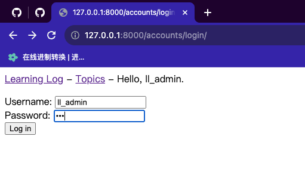

## 2. 用户账户

### 2.1 让用户能输入数据

#### 2.1.1 添加新主题

（1）创建表单

创建文件：`/Dev/learning_log/learning_logs/forms.py`

```python
from django import forms

from .models import Topic


class TopicForm(forms.ModelForm):
    class Meta:
        model = Topic
        fields = ['text']
        labels = {'text': ''}

```

（2）添加URL模式

修改文件：`/Dev/learning_log/learning_logs/urls.py`

```python
"""定义learning_logs的URL模式"""

from django.urls import path

from . import views

app_name = 'learning_logs'
urlpatterns = [
    # 主页
    path('', views.index, name='index'),
    # 显示所有主题的页面
    path('topics/', views.topics, name='topics'),
    # 特定主题的详细页面
    path('topics/<int:topic_id>/', views.topic, name='topic'),
    # 用于添加新主题的网页
    path('new_topic/', views.new_topic, name='new_topic'),
]

```

（3）视图

修改文件：`/Dev/learning_log/learning_logs/views.py`

```python
from django.shortcuts import render, redirect

from .models import Topic
from .forms import TopicForm


# Create your views here.
def index(request):
    """学习笔记的主页"""
    return render(request, 'learning_logs/index.html')


def topics(request):
    """显示所有的主题"""
    topics = Topic.objects.order_by('date_added')
    context = {'topics': topics}
    return render(request, 'learning_logs/topics.html', context)


def topic(request, topic_id):
    """显示单个主题及其所有的条目"""
    topic = Topic.objects.get(id=topic_id)
    entries = topic.entry_set.order_by('-date_added')
    context = {'topic': topic, 'entries': entries}
    return render(request, 'learning_logs/topic.html', context)


def new_topic(request):
    """添加新主题"""
    if request.method != 'POST':
        # 未提交数据：创建一个新表单
        form = TopicForm()
    else:
        # POST提交的数据：对数据进行处理
        form = TopicForm(data=request.POST)
        if form.is_valid():
            form.save()
            return redirect('learning_logs:topics')

    # 显示空表单或指出表单数据无效
    context = {'form': form}
    return render(request, 'learning_logs/new_topic.html', context)

```

（4）模版

创建文件：`/Dev/learning_log/learning_logs/templates/learning_logs/new_topic.html`

```html



  <p> Add a new topic:</p>

  <form action="" method="post">
      
      {{ form.as_div }}
      <button name="submit">Add topic</button>
  </form>



```

（5）链接到页面new_topic

修改文件：`/Dev/learning_log/learning_logs/templates/learning_logs/topics.html`

```html



  <p>Topics</p>

  <ul>
      
        <li>
            <a href="">{{ topic.text }}</a>
        </li>
      
        <li>No topics have been added yet.</li>
      
  </ul>

  <a href="">Add a new topic</a>



```

#### 2.1.2 添加新条目

（1）修改表单

修改文件：`/Dev/learning_log/learning_logs/forms.py`

```python
from django import forms

from .models import Topic, Entry


class TopicForm(forms.ModelForm):
    class Meta:
        model = Topic
        fields = ['text']
        labels = {'text': ''}


class EntryForm(forms.ModelForm):
    class Meta:
        model = Entry
        fields = ['text']
        labels = {'text': ''}
        widgets = {'text': forms.Textarea(attrs={'col': 80})}


```

（2）添加URL模式

修改文件：`/Dev/learning_log/learning_logs/urls.py`

```python
"""定义learning_logs的URL模式"""

from django.urls import path

from . import views

app_name = 'learning_logs'
urlpatterns = [
    # 主页
    path('', views.index, name='index'),
    # 显示所有主题的页面
    path('topics/', views.topics, name='topics'),
    # 特定主题的详细页面
    path('topics/<int:topic_id>/', views.topic, name='topic'),
    # 用于添加新主题的网页
    path('new_topic/', views.new_topic, name='new_topic'),
    # 用于添加新条目的页面
    path('new_entry/<int:topic_id>/', views.new_entry, name='new_entry')
]

```

（3）视图

修改文件：`/Dev/learning_log/learning_logs/views.py`

```python
from django.shortcuts import render, redirect

from .models import Topic
from .forms import TopicForm, EntryForm


# Create your views here.
def index(request):
    """学习笔记的主页"""
    return render(request, 'learning_logs/index.html')


def topics(request):
    """显示所有的主题"""
    topics = Topic.objects.order_by('date_added')
    context = {'topics': topics}
    return render(request, 'learning_logs/topics.html', context)


def topic(request, topic_id):
    """显示单个主题及其所有的条目"""
    topic = Topic.objects.get(id=topic_id)
    entries = topic.entry_set.order_by('-date_added')
    context = {'topic': topic, 'entries': entries}
    return render(request, 'learning_logs/topic.html', context)


def new_topic(request):
    """添加新主题"""
    if request.method != 'POST':
        # 未提交数据：创建一个新表单
        form = TopicForm()
    else:
        # POST提交的数据：对数据进行处理
        form = TopicForm(data=request.POST)
        if form.is_valid():
            form.save()
            return redirect('learning_logs:topics')

    # 显示空表单或指出表单数据无效
    context = {'form': form}
    return render(request, 'learning_logs/new_topic.html', context)


def new_entry(request, topic_id):
    """在特定主题中添加新条目"""
    topic = Topic.objects.get(id=topic_id)
    if request.method != 'POST':
        # 未提交数据：创建一个空表单
        form = EntryForm()
    else:
        # POST提交的数据：对数据进行处理
        form = EntryForm(data=request.POST)
        if form.is_valid():
            new_entry = form.save(commit=False)
            new_entry.topic = topic
            new_entry.save()
            return redirect('learning_logs:topic', topic_id=topic_id)

    # 显示空表单或指出表单数据无效
    context = {'topic': topic, 'form': form}
    return render(request, 'learning_logs/new_entry.html', context)

```

（4）模版

创建文件：`/Dev/learning_log/learning_logs/templates/learning_logs/new_entry.html`

```html



  <p><a href="">{{ topic }}</a></p>

  <p> Add a new entry:</p>
  <form action="" method="post">
      
      {{ form.as_div }}
      <button name="submit">Add entry</button>
  </form>



```

（5）链接到页面new_entry

修改文件：`/Dev/learning_log/learning_logs/templates/learning_logs/topic.html`

```html




  <p>Topic: {{ topic.text }}</p>

  <p>Entries: </p>
  <p>
     <a href="">Add a new entry</a>
  </p>

  <ul>
      
        <li>
            <p>{{ entry.date_added|date:'M d, Y H:i' }}</p>
            <p>{{ entry.text|linebreaks }}</p>
        </li>
      
        <li>There are no entries for this topic yet.</li>
      
  </ul>



```

#### 2.1.3 编辑条目

（1）添加URL模式

修改文件：`/Dev/learning_log/learning_logs/urls.py`

```python
"""定义learning_logs的URL模式"""

from django.urls import path

from . import views

app_name = 'learning_logs'
urlpatterns = [
    # 主页
    path('', views.index, name='index'),
    # 显示所有主题的页面
    path('topics/', views.topics, name='topics'),
    # 特定主题的详细页面
    path('topics/<int:topic_id>/', views.topic, name='topic'),
    # 用于添加新主题的网页
    path('new_topic/', views.new_topic, name='new_topic'),
    # 用于添加新条目的页面
    path('new_entry/<int:topic_id>/', views.new_entry, name='new_entry'),
    # 用于编辑条目的页面
    path('edit_entry/<int:entry_id>/', views.edit_entry, name='edit_entry'),
]

```

（2）视图

修改文件：`/Dev/learning_log/learning_logs/views.py`

```python
from django.shortcuts import render, redirect

from .models import Topic, Entry
from .forms import TopicForm, EntryForm


# Create your views here.
def index(request):
    """学习笔记的主页"""
    return render(request, 'learning_logs/index.html')


def topics(request):
    """显示所有的主题"""
    topics = Topic.objects.order_by('date_added')
    context = {'topics': topics}
    return render(request, 'learning_logs/topics.html', context)


def topic(request, topic_id):
    """显示单个主题及其所有的条目"""
    topic = Topic.objects.get(id=topic_id)
    entries = topic.entry_set.order_by('-date_added')
    context = {'topic': topic, 'entries': entries}
    return render(request, 'learning_logs/topic.html', context)


def new_topic(request):
    """添加新主题"""
    if request.method != 'POST':
        # 未提交数据：创建一个新表单
        form = TopicForm()
    else:
        # POST提交的数据：对数据进行处理
        form = TopicForm(data=request.POST)
        if form.is_valid():
            form.save()
            return redirect('learning_logs:topics')

    # 显示空表单或指出表单数据无效
    context = {'form': form}
    return render(request, 'learning_logs/new_topic.html', context)


def new_entry(request, topic_id):
    """在特定主题中添加新条目"""
    topic = Topic.objects.get(id=topic_id)
    if request.method != 'POST':
        # 未提交数据：创建一个空表单
        form = EntryForm()
    else:
        # POST提交的数据：对数据进行处理
        form = EntryForm(data=request.POST)
        if form.is_valid():
            new_entry = form.save(commit=False)
            new_entry.topic = topic
            new_entry.save()
            return redirect('learning_logs:topic', topic_id=topic_id)

    # 显示空表单或指出表单数据无效
    context = {'topic': topic, 'form': form}
    return render(request, 'learning_logs/new_entry.html', context)


def edit_entry(request, entry_id):
    """编辑既有的条目"""
    entry = Entry.objects.get(id=entry_id)
    topic = entry.topic

    if request.method != 'POST':
        # 初次请求：使用当前的条目填充表单
        form = EntryForm(instance=entry)
    else:
        # POST提交的数据：对数据进行处理
        form = EntryForm(instance=entry, data=request.POST)
        if form.is_valid():
            form.save()
            return redirect('learning_logs:topic', topic_id=topic.id)

    context = {'entry': entry, 'topic': topic, 'form': form}
    return render(request, 'learning_logs/edit_entry.html', context)

```

（3）模版

创建文件：`/Dev/learning_log/learning_logs/templates/learning_logs/edit_entry.html`

```html



  <p><a href="">{{ topic }}</a></p>

  <p>Edit entry:</p>

  <form action="" method="post">
      
      {{ form.as_div }}
      <button name="submit">Save change</button>
  </form>



```

（4）链接到页面edit_entry

修改文件：`/Dev/learning_log/learning_logs/templates/learning_logs/topic.html`

```html




  <p>Topic: {{ topic.text }}</p>

  <p>Entries: </p>
  <p>
     <a href="">Add a new entry</a>
  </p>

  <ul>
      
        <li>
            <p>{{ entry.date_added|date:'M d, Y H:i' }}</p>
            <p>{{ entry.text|linebreaks }}</p>
            <p>
                <a href="">Edit entry</a>
            </p>
        </li>
      
        <li>There are no entries for this topic yet.</li>
      
  </ul>



```

### 2.2 创建用户账户

#### 2.2.1 设置登录页面

（1）创建应用程序accounts

```bash
(ll_env)  niu0217@niuM  ~/niuGithub/WebApplication/Dev/learning_log   main ±  python manage.py startapp accounts     
(ll_env)  niu0217@niuM  ~/niuGithub/WebApplication/Dev/learning_log   main ±  ls   
accounts      db.sqlite3    learning_logs ll_env        ll_project    manage.py
(ll_env)  niu0217@niuM  ~/niuGithub/WebApplication/Dev/learning_log   main ±  ls accounts 
__init__.py admin.py    apps.py     migrations  models.py   tests.py    views.py
(ll_env)  niu0217@niuM  ~/niuGithub/WebApplication/Dev/learning_log   main ±  

```

（2）将accounts加入到settings.py

修改`/Dev/learning_log/ll_project/settings.py`，将其中的INSTALLED_APPS变量修改为如下形式：

```python
INSTALLED_APPS = [
    # 我的应用程序
    'learning_logs',
    'accounts',

    # Django默认添加的应用程序
    'django.contrib.admin',
    'django.contrib.auth',
    'django.contrib.contenttypes',
    'django.contrib.sessions',
    'django.contrib.messages',
    'django.contrib.staticfiles',
]
```

（3）设置URL

修改文件：`/Dev/learning_log/ll_project/urls.py`

```python
"""
URL configuration for ll_project project.

The `urlpatterns` list routes URLs to views. For more information please see:
    https://docs.djangoproject.com/en/4.2/topics/http/urls/
Examples:
Function views
    1. Add an import:  from my_app import views
    2. Add a URL to urlpatterns:  path('', views.home, name='home')
Class-based views
    1. Add an import:  from other_app.views import Home
    2. Add a URL to urlpatterns:  path('', Home.as_view(), name='home')
Including another URLconf
    1. Import the include() function: from django.urls import include, path
    2. Add a URL to urlpatterns:  path('blog/', include('blog.urls'))
"""
from django.contrib import admin
from django.urls import path, include

# urlpatterns包含项目中应用程序的URL
urlpatterns = [
    path('admin/', admin.site.urls),
    path('accounts/', include('accounts.urls')),
    path('', include('learning_logs.urls'))
]

```

添加文件：`/Dev/learning_log/accounts/urls.py`

```python
"""定义accounts的URL模式"""

from django.urls import path, include

app_name = 'accounts'
urlpatterns = [
    # 包含默认的身份认证URL
    path('', include('django.contrib.auth.urls')),
]

```

（4）设置模版

添加文件：`/Dev/learning_log/accounts/templates/registration/login.html`

```html




  
    <p>Your username and password didn't match. Please try again.</p>
  

  <form action="" method='post'>
    
    {{ form.as_div }}

    <button name="submit">Log in</button>
  </form>



```

（5）设置LOGIN_REDIRECT_URL

修改文件：在`/Dev/learning_log/ll_project/settings.py`的最后面添加：

```python
# 我的设置
LOGIN_REDIRECT_URL = 'learning_logs:index'
```

（6）链接到登录界面

修改文件：`/Dev/learning_log/learning_logs/templates/learning_logs/base.html`

```html
<p>
  <a href="">Learning Log</a> -
  <a href="">Topics</a> -
  
    Hello, {{ user.username }}.
  
    <a href="">Log in</a>
  
</p>



```

网址：http://127.0.0.1:8000/accounts/login/

 

#### 2.2.2 注销

（1）修改文件：`/Dev/learning_log/learning_logs/templates/learning_logs/base.html`

```html
<p>
  <a href="">Learning Log</a> -
  <a href="">Topics</a> -
  
    Hello, {{ user.username }}.
  
    <a href="">Log in</a>
  
</p>




  <hr />
  <form action="" method="post">
    
    <button name="submit">Log out</button>
  </form>


```

（2）设置LOGOUT_REDIRECT_URL

修改文件：在`/Dev/learning_log/ll_project/settings.py`的最后面添加：

```python
LOGOUT_REDIRECT_URL = 'learning_logs:index'
```

#### 2.2.3 注册页面

（1）注册页面的URL模式

修改文件：`/Dev/learning_log/accounts/urls.py`

```python
"""定义accounts的URL模式"""

from django.urls import path, include

from . import views

app_name = 'accounts'
urlpatterns = [
    # 包含默认的身份认证URL
    path('', include('django.contrib.auth.urls')),
    # 注册页面
    path('register/', views.register, name="register"),
]

```

（2）视图函数

修改文件：`/Dev/learning_log/accounts/views.py`

```python
from django.shortcuts import render, redirect
from django.contrib.auth import login
from django.contrib.auth.forms import UserCreationForm


def register(request):
    """注册新用户"""
    if request.method != 'POST':
        # Display blank registration form.
        form = UserCreationForm()
    else:
        # Process completed form.
        form = UserCreationForm(data=request.POST)

        if form.is_valid():
            new_user = form.save()
            # Log the user in and then redirect to home page.
            login(request, new_user)
            return redirect('learning_logs:index')

    # Display a blank or invalid form.
    context = {'form': form}
    return render(request, 'registration/register.html', context)

```

（3）注册模版

添加文件：`/Dev/learning_log/accounts/templates/registration/register.html`

```html




  <form action="" method='post'>
    
    {{ form.as_div }}

    <button name="submit">Register</button>
  </form>



```

（4）链接到注册页面

修改文件：`/Dev/learning_log/learning_logs/templates/learning_logs/base.html`

```html
<p>
  <a href="">Learning Log</a> -
  <a href="">Topics</a> -
  
    Hello, {{ user.username }}.
  
    <a href="">Register</a> -
    <a href="">Log in</a>
  
</p>




  <hr />
  <form action="" method="post">
    
    <button name="submit">Log out</button>
  </form>


```

### 2.3 让用户拥有自己的数据

#### 2.3.1 限制对页面topics的访问

修改文件：`/Dev/learning_log/learning_logs/views.py`

```python
from django.shortcuts import render, redirect
from django.contrib.auth.decorators import login_required

from .models import Topic, Entry
from .forms import TopicForm, EntryForm


# Create your views here.
def index(request):
    """学习笔记的主页"""
    return render(request, 'learning_logs/index.html')


@login_required
def topics(request):
    """显示所有的主题"""
    topics = Topic.objects.order_by('date_added')
    context = {'topics': topics}
    return render(request, 'learning_logs/topics.html', context)


def topic(request, topic_id):
    """显示单个主题及其所有的条目"""
    topic = Topic.objects.get(id=topic_id)
    entries = topic.entry_set.order_by('-date_added')
    context = {'topic': topic, 'entries': entries}
    return render(request, 'learning_logs/topic.html', context)


def new_topic(request):
    """添加新主题"""
    if request.method != 'POST':
        # 未提交数据：创建一个新表单
        form = TopicForm()
    else:
        # POST提交的数据：对数据进行处理
        form = TopicForm(data=request.POST)
        if form.is_valid():
            form.save()
            return redirect('learning_logs:topics')

    # 显示空表单或指出表单数据无效
    context = {'form': form}
    return render(request, 'learning_logs/new_topic.html', context)


def new_entry(request, topic_id):
    """在特定主题中添加新条目"""
    topic = Topic.objects.get(id=topic_id)
    if request.method != 'POST':
        # 未提交数据：创建一个空表单
        form = EntryForm()
    else:
        # POST提交的数据：对数据进行处理
        form = EntryForm(data=request.POST)
        if form.is_valid():
            new_entry = form.save(commit=False)
            new_entry.topic = topic
            new_entry.save()
            return redirect('learning_logs:topic', topic_id=topic_id)

    # 显示空表单或指出表单数据无效
    context = {'topic': topic, 'form': form}
    return render(request, 'learning_logs/new_entry.html', context)


def edit_entry(request, entry_id):
    """编辑既有的条目"""
    entry = Entry.objects.get(id=entry_id)
    topic = entry.topic

    if request.method != 'POST':
        # 初次请求：使用当前的条目填充表单
        form = EntryForm(instance=entry)
    else:
        # POST提交的数据：对数据进行处理
        form = EntryForm(instance=entry, data=request.POST)
        if form.is_valid():
            form.save()
            return redirect('learning_logs:topic', topic_id=topic.id)

    context = {'entry': entry, 'topic': topic, 'form': form}
    return render(request, 'learning_logs/edit_entry.html', context)

```

修改文件：`/Dev/learning_log/ll_project/settings.py`

在最后面添加

```python
LOGIN_URL = 'accounts:login'
```

#### 2.3.2 全面限制对项目“学习笔记”的访问

修改文件：`/Dev/learning_log/learning_logs/views.py`

```python
from django.shortcuts import render, redirect
from django.contrib.auth.decorators import login_required

from .models import Topic, Entry
from .forms import TopicForm, EntryForm


# Create your views here.
def index(request):
    """学习笔记的主页"""
    return render(request, 'learning_logs/index.html')


@login_required
def topics(request):
    """显示所有的主题"""
    topics = Topic.objects.order_by('date_added')
    context = {'topics': topics}
    return render(request, 'learning_logs/topics.html', context)


@login_required
def topic(request, topic_id):
    """显示单个主题及其所有的条目"""
    topic = Topic.objects.get(id=topic_id)
    entries = topic.entry_set.order_by('-date_added')
    context = {'topic': topic, 'entries': entries}
    return render(request, 'learning_logs/topic.html', context)


@login_required
def new_topic(request):
    """添加新主题"""
    if request.method != 'POST':
        # 未提交数据：创建一个新表单
        form = TopicForm()
    else:
        # POST提交的数据：对数据进行处理
        form = TopicForm(data=request.POST)
        if form.is_valid():
            form.save()
            return redirect('learning_logs:topics')

    # 显示空表单或指出表单数据无效
    context = {'form': form}
    return render(request, 'learning_logs/new_topic.html', context)


@login_required
def new_entry(request, topic_id):
    """在特定主题中添加新条目"""
    topic = Topic.objects.get(id=topic_id)
    if request.method != 'POST':
        # 未提交数据：创建一个空表单
        form = EntryForm()
    else:
        # POST提交的数据：对数据进行处理
        form = EntryForm(data=request.POST)
        if form.is_valid():
            new_entry = form.save(commit=False)
            new_entry.topic = topic
            new_entry.save()
            return redirect('learning_logs:topic', topic_id=topic_id)

    # 显示空表单或指出表单数据无效
    context = {'topic': topic, 'form': form}
    return render(request, 'learning_logs/new_entry.html', context)


@login_required
def edit_entry(request, entry_id):
    """编辑既有的条目"""
    entry = Entry.objects.get(id=entry_id)
    topic = entry.topic

    if request.method != 'POST':
        # 初次请求：使用当前的条目填充表单
        form = EntryForm(instance=entry)
    else:
        # POST提交的数据：对数据进行处理
        form = EntryForm(instance=entry, data=request.POST)
        if form.is_valid():
            form.save()
            return redirect('learning_logs:topic', topic_id=topic.id)

    context = {'entry': entry, 'topic': topic, 'form': form}
    return render(request, 'learning_logs/edit_entry.html', context)

```

#### 2.3.3 将数据关联到用户

（1）修改模型Topic

修改文件：`/Dev/learning_log/learning_logs/models.py`

```python
from django.db import models
from django.contrib.auth.models import User


# Create your models here.
class Topic(models.Model):
    """用户学习的主题"""

    text = models.CharField(max_length=200)  # 用于存储标题、名称等小文本
    date_added = models.DateTimeField(auto_now_add=True)  # 获取当前时间
    owner = models.ForeignKey(User, on_delete=models.CASCADE)

    def __str__(self):
        """返回模型的字符串表示"""
        return self.text


class Entry(models.Model):
    """学到的有关某个主题的具体知识"""

    # 建立外键，采用级联删除
    topic = models.ForeignKey(Topic, on_delete=models.CASCADE)
    text = models.TextField()
    date_added = models.DateTimeField(auto_now_add=True)  # 获取当前时间

    class Meta:
        verbose_name_plural = 'entries'

    def __str__(self):
        """返回一个表示条目的简单字符串"""
        return f"{self.text[:50]}..."


```

（2）迁移数据库

```bash
(ll_env)  niu0217@niuM  ~/niuGithub/WebApplication/Dev/learning_log   main ±  python manage.py makemigrations learning_logs
It is impossible to add a non-nullable field 'owner' to topic without specifying a default. This is because the database needs something to populate existing rows.
Please select a fix:
 1) Provide a one-off default now (will be set on all existing rows with a null value for this column)
 2) Quit and manually define a default value in models.py.
Select an option: 1
Please enter the default value as valid Python.
The datetime and django.utils.timezone modules are available, so it is possible to provide e.g. timezone.now as a value.
Type 'exit' to exit this prompt
>>> 1
Migrations for 'learning_logs':
  learning_logs/migrations/0003_topic_owner.py
    - Add field owner to topic
(ll_env)  niu0217@niuM  ~/niuGithub/WebApplication/Dev/learning_log   main ±  
```

```bash
(ll_env)  niu0217@niuM  ~/niuGithub/WebApplication/Dev/learning_log   main ±  python manage.py migrate   
Operations to perform:
  Apply all migrations: admin, auth, contenttypes, learning_logs, sessions
Running migrations:
  Applying learning_logs.0003_topic_owner... OK
(ll_env)  niu0217@niuM  ~/niuGithub/WebApplication/Dev/learning_log   main ±  
```

#### 2.3.4 只允许用户访问自己的主题

修改文件：`/Dev/learning_log/learning_logs/views.py`

```python
from django.shortcuts import render, redirect
from django.contrib.auth.decorators import login_required

from .models import Topic, Entry
from .forms import TopicForm, EntryForm


# Create your views here.
def index(request):
    """学习笔记的主页"""
    return render(request, 'learning_logs/index.html')


@login_required
def topics(request):
    """显示所有的主题"""
    topics = Topic.objects.filter(owner=request.user).order_by('date_added')
    context = {'topics': topics}
    return render(request, 'learning_logs/topics.html', context)


@login_required
def topic(request, topic_id):
    """显示单个主题及其所有的条目"""
    topic = Topic.objects.get(id=topic_id)
    entries = topic.entry_set.order_by('-date_added')
    context = {'topic': topic, 'entries': entries}
    return render(request, 'learning_logs/topic.html', context)


@login_required
def new_topic(request):
    """添加新主题"""
    if request.method != 'POST':
        # 未提交数据：创建一个新表单
        form = TopicForm()
    else:
        # POST提交的数据：对数据进行处理
        form = TopicForm(data=request.POST)
        if form.is_valid():
            form.save()
            return redirect('learning_logs:topics')

    # 显示空表单或指出表单数据无效
    context = {'form': form}
    return render(request, 'learning_logs/new_topic.html', context)


@login_required
def new_entry(request, topic_id):
    """在特定主题中添加新条目"""
    topic = Topic.objects.get(id=topic_id)
    if request.method != 'POST':
        # 未提交数据：创建一个空表单
        form = EntryForm()
    else:
        # POST提交的数据：对数据进行处理
        form = EntryForm(data=request.POST)
        if form.is_valid():
            new_entry = form.save(commit=False)
            new_entry.topic = topic
            new_entry.save()
            return redirect('learning_logs:topic', topic_id=topic_id)

    # 显示空表单或指出表单数据无效
    context = {'topic': topic, 'form': form}
    return render(request, 'learning_logs/new_entry.html', context)


@login_required
def edit_entry(request, entry_id):
    """编辑既有的条目"""
    entry = Entry.objects.get(id=entry_id)
    topic = entry.topic

    if request.method != 'POST':
        # 初次请求：使用当前的条目填充表单
        form = EntryForm(instance=entry)
    else:
        # POST提交的数据：对数据进行处理
        form = EntryForm(instance=entry, data=request.POST)
        if form.is_valid():
            form.save()
            return redirect('learning_logs:topic', topic_id=topic.id)

    context = {'entry': entry, 'topic': topic, 'form': form}
    return render(request, 'learning_logs/edit_entry.html', context)

```

#### 2.3.5 保护用户的主题

修改文件：`/Dev/learning_log/learning_logs/views.py`

```python
from django.shortcuts import render, redirect
from django.contrib.auth.decorators import login_required
from django.http import Http404

from .models import Topic, Entry
from .forms import TopicForm, EntryForm


# Create your views here.
def index(request):
    """学习笔记的主页"""
    return render(request, 'learning_logs/index.html')


@login_required
def topics(request):
    """显示所有的主题"""
    topics = Topic.objects.filter(owner=request.user).order_by('date_added')
    context = {'topics': topics}
    return render(request, 'learning_logs/topics.html', context)


@login_required
def topic(request, topic_id):
    """显示单个主题及其所有的条目"""
    topic = Topic.objects.get(id=topic_id)
    # 确认请求主题属于当前用户
    if topic.owner != request.user:
        raise Http404
    
    entries = topic.entry_set.order_by('-date_added')
    context = {'topic': topic, 'entries': entries}
    return render(request, 'learning_logs/topic.html', context)


@login_required
def new_topic(request):
    """添加新主题"""
    if request.method != 'POST':
        # 未提交数据：创建一个新表单
        form = TopicForm()
    else:
        # POST提交的数据：对数据进行处理
        form = TopicForm(data=request.POST)
        if form.is_valid():
            form.save()
            return redirect('learning_logs:topics')

    # 显示空表单或指出表单数据无效
    context = {'form': form}
    return render(request, 'learning_logs/new_topic.html', context)


@login_required
def new_entry(request, topic_id):
    """在特定主题中添加新条目"""
    topic = Topic.objects.get(id=topic_id)
    if request.method != 'POST':
        # 未提交数据：创建一个空表单
        form = EntryForm()
    else:
        # POST提交的数据：对数据进行处理
        form = EntryForm(data=request.POST)
        if form.is_valid():
            new_entry = form.save(commit=False)
            new_entry.topic = topic
            new_entry.save()
            return redirect('learning_logs:topic', topic_id=topic_id)

    # 显示空表单或指出表单数据无效
    context = {'topic': topic, 'form': form}
    return render(request, 'learning_logs/new_entry.html', context)


@login_required
def edit_entry(request, entry_id):
    """编辑既有的条目"""
    entry = Entry.objects.get(id=entry_id)
    topic = entry.topic

    if request.method != 'POST':
        # 初次请求：使用当前的条目填充表单
        form = EntryForm(instance=entry)
    else:
        # POST提交的数据：对数据进行处理
        form = EntryForm(instance=entry, data=request.POST)
        if form.is_valid():
            form.save()
            return redirect('learning_logs:topic', topic_id=topic.id)

    context = {'entry': entry, 'topic': topic, 'form': form}
    return render(request, 'learning_logs/edit_entry.html', context)

```

#### 2.3.6 保护页面edit_entry

修改文件：`/Dev/learning_log/learning_logs/views.py`

```python
from django.shortcuts import render, redirect
from django.contrib.auth.decorators import login_required
from django.http import Http404

from .models import Topic, Entry
from .forms import TopicForm, EntryForm


# Create your views here.
def index(request):
    """学习笔记的主页"""
    return render(request, 'learning_logs/index.html')


@login_required
def topics(request):
    """显示所有的主题"""
    topics = Topic.objects.filter(owner=request.user).order_by('date_added')
    context = {'topics': topics}
    return render(request, 'learning_logs/topics.html', context)


@login_required
def topic(request, topic_id):
    """显示单个主题及其所有的条目"""
    topic = Topic.objects.get(id=topic_id)
    # 确认请求主题属于当前用户
    if topic.owner != request.user:
        raise Http404
    
    entries = topic.entry_set.order_by('-date_added')
    context = {'topic': topic, 'entries': entries}
    return render(request, 'learning_logs/topic.html', context)


@login_required
def new_topic(request):
    """添加新主题"""
    if request.method != 'POST':
        # 未提交数据：创建一个新表单
        form = TopicForm()
    else:
        # POST提交的数据：对数据进行处理
        form = TopicForm(data=request.POST)
        if form.is_valid():
            form.save()
            return redirect('learning_logs:topics')

    # 显示空表单或指出表单数据无效
    context = {'form': form}
    return render(request, 'learning_logs/new_topic.html', context)


@login_required
def new_entry(request, topic_id):
    """在特定主题中添加新条目"""
    topic = Topic.objects.get(id=topic_id)
    if request.method != 'POST':
        # 未提交数据：创建一个空表单
        form = EntryForm()
    else:
        # POST提交的数据：对数据进行处理
        form = EntryForm(data=request.POST)
        if form.is_valid():
            new_entry = form.save(commit=False)
            new_entry.topic = topic
            new_entry.save()
            return redirect('learning_logs:topic', topic_id=topic_id)

    # 显示空表单或指出表单数据无效
    context = {'topic': topic, 'form': form}
    return render(request, 'learning_logs/new_entry.html', context)


@login_required
def edit_entry(request, entry_id):
    """编辑既有的条目"""
    entry = Entry.objects.get(id=entry_id)
    topic = entry.topic
    # 确认请求主题属于当前用户
    if topic.owner != request.user:
        raise Http404

    if request.method != 'POST':
        # 初次请求：使用当前的条目填充表单
        form = EntryForm(instance=entry)
    else:
        # POST提交的数据：对数据进行处理
        form = EntryForm(instance=entry, data=request.POST)
        if form.is_valid():
            form.save()
            return redirect('learning_logs:topic', topic_id=topic.id)

    context = {'entry': entry, 'topic': topic, 'form': form}
    return render(request, 'learning_logs/edit_entry.html', context)

```

#### 2.3.7 将新主题关联到当前用户

修改文件：`/Dev/learning_log/learning_logs/views.py`

```python
from django.shortcuts import render, redirect
from django.contrib.auth.decorators import login_required
from django.http import Http404

from .models import Topic, Entry
from .forms import TopicForm, EntryForm


# Create your views here.
def index(request):
    """学习笔记的主页"""
    return render(request, 'learning_logs/index.html')


@login_required
def topics(request):
    """显示所有的主题"""
    topics = Topic.objects.filter(owner=request.user).order_by('date_added')
    context = {'topics': topics}
    return render(request, 'learning_logs/topics.html', context)


@login_required
def topic(request, topic_id):
    """显示单个主题及其所有的条目"""
    topic = Topic.objects.get(id=topic_id)
    # 确认请求主题属于当前用户
    if topic.owner != request.user:
        raise Http404

    entries = topic.entry_set.order_by('-date_added')
    context = {'topic': topic, 'entries': entries}
    return render(request, 'learning_logs/topic.html', context)


@login_required
def new_topic(request):
    """添加新主题"""
    if request.method != 'POST':
        # 未提交数据：创建一个新表单
        form = TopicForm()
    else:
        # POST提交的数据：对数据进行处理
        form = TopicForm(data=request.POST)
        if form.is_valid():
            new_topic = form.save(commit=False)
            new_topic.owner = request.user
            new_topic.save()
            return redirect('learning_logs:topics')

    # 显示空表单或指出表单数据无效
    context = {'form': form}
    return render(request, 'learning_logs/new_topic.html', context)


@login_required
def new_entry(request, topic_id):
    """在特定主题中添加新条目"""
    topic = Topic.objects.get(id=topic_id)
    if request.method != 'POST':
        # 未提交数据：创建一个空表单
        form = EntryForm()
    else:
        # POST提交的数据：对数据进行处理
        form = EntryForm(data=request.POST)
        if form.is_valid():
            new_entry = form.save(commit=False)
            new_entry.topic = topic
            new_entry.save()
            return redirect('learning_logs:topic', topic_id=topic_id)

    # 显示空表单或指出表单数据无效
    context = {'topic': topic, 'form': form}
    return render(request, 'learning_logs/new_entry.html', context)


@login_required
def edit_entry(request, entry_id):
    """编辑既有的条目"""
    entry = Entry.objects.get(id=entry_id)
    topic = entry.topic
    # 确认请求主题属于当前用户
    if topic.owner != request.user:
        raise Http404

    if request.method != 'POST':
        # 初次请求：使用当前的条目填充表单
        form = EntryForm(instance=entry)
    else:
        # POST提交的数据：对数据进行处理
        form = EntryForm(instance=entry, data=request.POST)
        if form.is_valid():
            form.save()
            return redirect('learning_logs:topic', topic_id=topic.id)

    context = {'entry': entry, 'topic': topic, 'form': form}
    return render(request, 'learning_logs/edit_entry.html', context)

```

